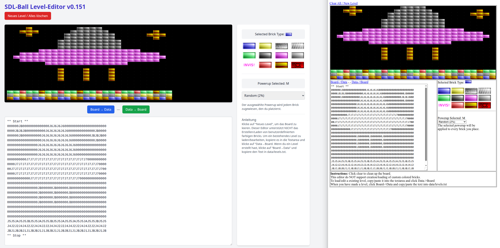
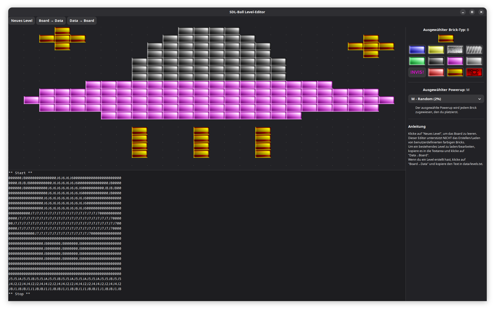

# Jimmy Christensens SDL-Ball

**Game is currently not building.**
`make tests` to run manual tests.

Some manual tests:

https://github.com/user-attachments/assets/6edef4a5-070b-4f8f-8329-65b208e1741a

https://github.com/user-attachments/assets/4cc262ef-ef83-4190-9624-29d8ae54b69c

I pulled the Repository via <https://aur.archlinux.org/cgit/aur.git/tree/PKGBUILD?h=sdl-ball>.
With sound enabled, the rendering was broken for me.
I had to initialize the soundClass before creating the window and opengl-context.

Check out the following commit for the fixed code, while the rest stays the same:

2de3f8ca2dc5c2de78da38bcbb6a55dd238df17a

`git checkout 2de3f8c`

## Work in Progress

I am going to modernize the code in my spare time for educational purposes.

The current Target is OpenGL 4.6 and SDL3.

Feel free to commit pull requests.

See: [get started](docs/Developer/GetInvolved.md)
or
See: [Todo](docs/Developer/Todo.md)

What I am currently on: [Current](docs/Developer/CURRENT.md)

## Significant changes

- Theming is more versatile
- Event driven architecture
- Projection change to 2D-Orthographic
- Using OpenGL 3.1 compatibility profile See: [Projection](docs/Developer/OpenGL/Projection.md)
- no Windows support (macOS should be easy to add)
- no WiiMote support (currently)
- sound always enabled
- positional sound does recognize the Y-axis
- Animation can be played once

The config is now in `.config/SDL-Ball`, not `sdl-ball` anymore.
You can copy the files from the old folder to the new one, should just work.

