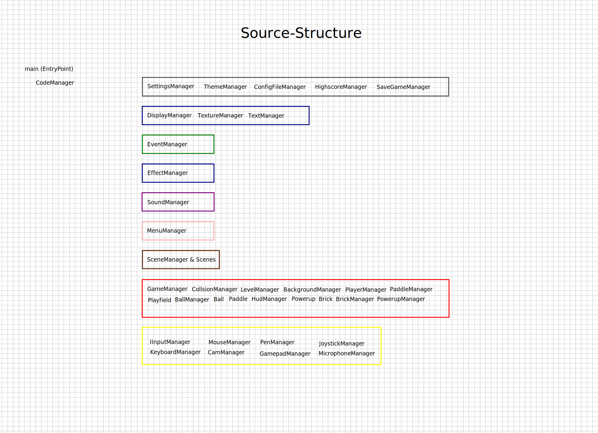

# Game Development—Introduction

This document provides an overview of the game development process, focusing on the SDL-Ball Remastered project.

## Table of Contents

### Files

- [CURRENT.md](CURRENT.md) - Things I am currently working on
- [GetInvolved.md](GetInvolved.md) - How to get involved in the project
- [Intro.md](Intro.md) - This document
- [Managers.md](Managers.md) - Overview of the manager classes
- [MosteWanted.md](MosteWanted.md) - Idioms that are most wanted in the project
- [Structure.md](Structure.md) - Overview of the source structure
- [Structure_Todo.md](Structure_Todo.md) - Todo items for the source structure
- [Todo.md](Todo.md) - Overview of tasks to be completed

### Directories

