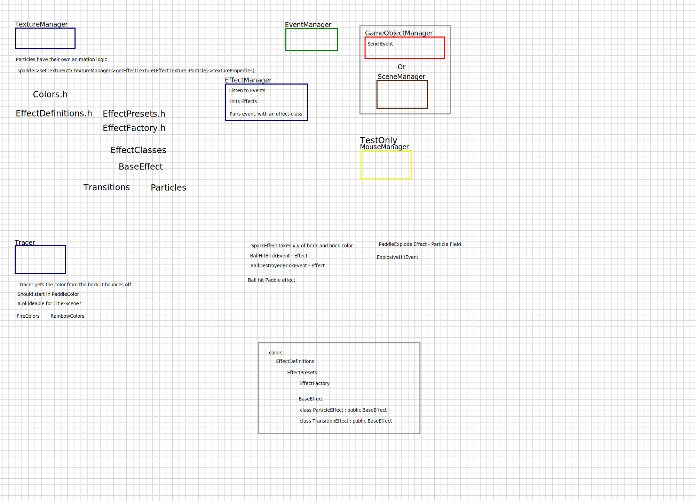

# EffectManager

The `EffectManager` is a manager designed to map `GameEvents` to effects.
It listens to specific game events and triggers corresponding visual effects using the `EffectFactory`.

Setting: eyeCandy = false, disables the effect manager.

## Key Responsibilities

- **Event Handling**: Registers listeners for game events from GameEvents.h.
- **Effect Creation**: Uses the `EffectFactory` to create effects dynamically based on event data.
- **Effect Management**: Stores and updates active effects.

## Methods Overview

- **Event Registration**:
    - `registerEventListeners()`: Registers event listeners for specific game events.

- **Event Handlers**:
    - `handleBallBrickCollision(const EventData &data)`: Creates a spark effect at the collision position.

- **Effect Retrieval**:
    - `getEffects() const`: Returns a list of currently active effects.

## Integration

The `EffectManager` integrates with the `EventManager` to dynamically respond to game events. It uses the
`EffectFactory` to generate effects based on predefined presets, ensuring consistent visual representation.

