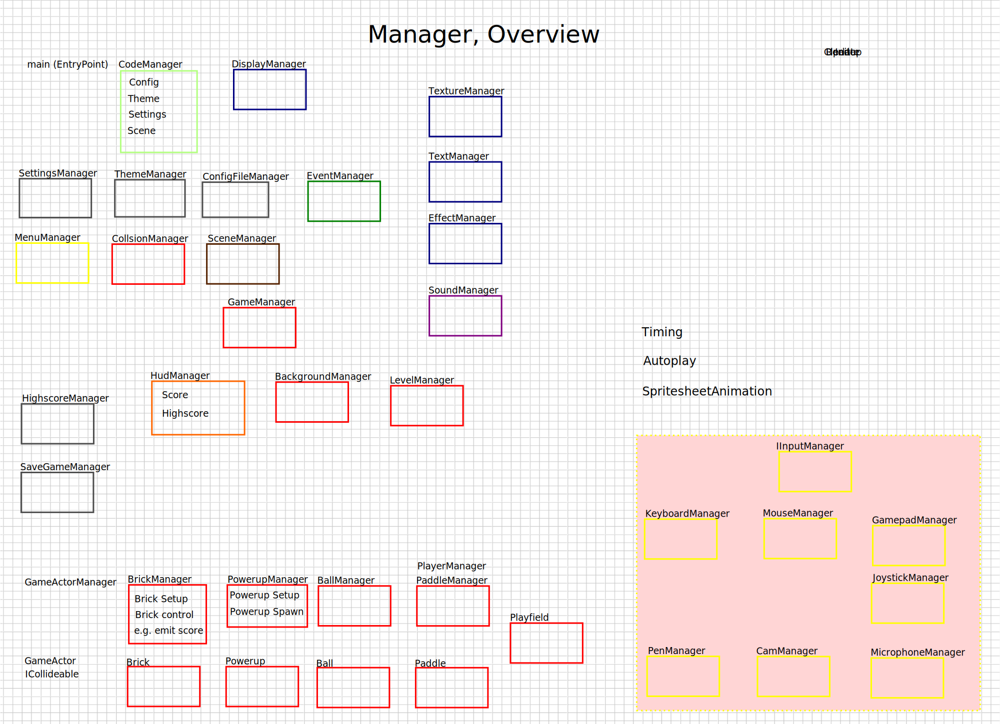

# ManagerClasses

## Manager-Types

InputManager: MouseManager, KeyboardManager, JoystickManager, ControllerManager
GameObjectManager: BallManager, BrickManager, PaddleManager, PowerupManager
VideoManager: [DisplayManager](Manager/DisplayManager.md), [TextureManager](Manager/TextureManager.md), EffectsManager,
AnimationManager
AudioManager: [SoundManager](Manager/SoundManager.md)

## Alphabetical Overview

[BackgroundManager](Manager/BackgroundManager.md)
[BallManager](Manager/BallManager.md)
[CodeManager](Manager/CodeManager.md) - TopLevel Manager
[CollisionManager](Manager/CollisionManager.md)
[ConfigFileManager](Manager/ConfigFileManager.md) - handles config pathes, evaluates and loads the config file.
[ControllerManager](Manager/ControllerManager.md) - handles the controller, and settings
[DisplayManager](Manager/DisplayManager.md) - handles the display, loads the display file and applies it to the game
[EffectManager](Manager/EffectManager.md) - handles the effects, loads the effect file and applies it to the game
[EventManager](Manager/EventManager.md) - handles the events, loads the event file and applies it to the game
[GameManager](Manager/GameManager.md) - handles the game state, loads the game-scene and manages the game loop
[HUDManager](Manager/HudManager.md) - handles the HUD, loads the HUD file and applies it to the game
[HighscoreManager](Manager/HighscoreManager.md) - handles the highscores, loads the highscores and saves them to the
file.
[LevelManager](Manager/LevelManager.md) - at start loads the LevelOffsets, and gives the new level after the player has
finished the level.
[MenuManager] - handles the menu, loads the menu file and applies it to the game
[PowerupManager](Manager/PowerupManager): Verwaltet Powerups (Spawning, Update, Rendering)
[SaveGameManager](Manager/SaveGameManager.md) - handles the savegame, loads the savegame and saves it to the file
[SceneManager] - handles the scenes, loads the scene file and applies it to the game
[SettingsManager](Manager/SettingsManager.md) - handles the settings, loads the settings and saves them to the file
[SoundManager](Manager/SoundManager.md) - Loading/Cleaning and playing sounds
[SpriteSheetAnimationManager] - handles global the sprite sheet animations, calculates the uv-coordinates and applies
them to the gameObjects
[TextManager](Manager/TextManager.md) - TextRendering
[TextureManager](Manager/TextureManager.md)
[ThemeManager](Manager/ThemeManager.md) - handles the themes, loads the theme file and applies it to the game

## See also

- [Structure](Structure.md)
- [Manual Tests](Tests/Manual-Tests.md)
