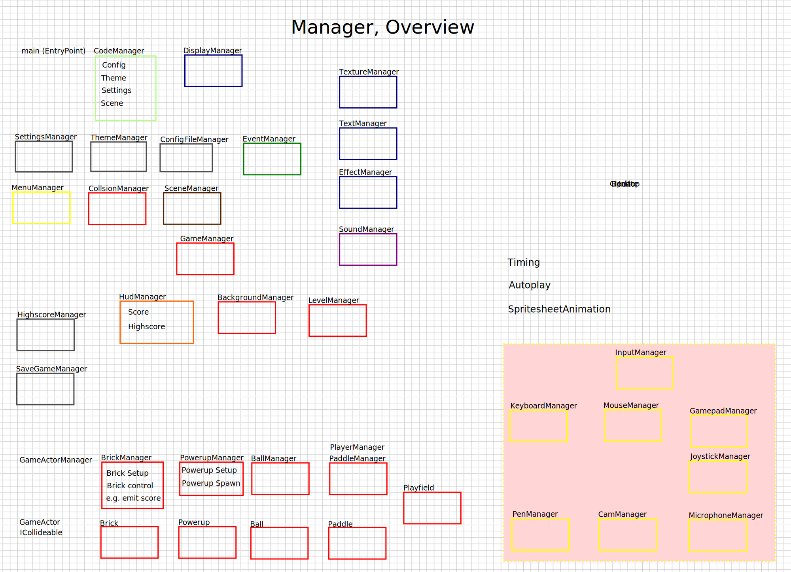

# ManagerClasses

## Setting-Types

Grundsätzlich haben wir 3 Typen von Einstellungen:

- default aus config.h - compileTime settings
- loaded - gespeicherte Settings des Spielers
- current - und die runtime settings

## Manager-Types

InputManager: MouseManager, KeyboardManager, JoystickManager, ControllerManager
GameObjectManager: BallManager, BrickManager, PaddleManager, PowerupManager

## Short Overview

[BackgroundManager](Manager/BackgroundManager.md) - handles the background, loads the background file and applies it to
the game
[BallManager](Manager/BallManager.md) - handles the balls, loads the ball file and applies it to the game
CodeManager - TopLevel Manager, der die anderen Manager initialisiert und verwaltet
[CollisionManager](Manager/CollisionManager.md) - handles the collisions, loads the collision file and applies it to the
game
[ConfigFileManager](Manager/ConfigFileManager.md) - handles config pathes, evaluates and loads the config file.
[ControllerManager](Manager/ControllerManager.md) - handles the controller, and settings
[EffectManager](Manager/EffectManager.md) - handles the effects, loads the effect file and applies it to the game
[EventManager](Manager/EventManager.md) - handles the events, loads the event file and applies it to the game
[DisplayManager](Manager/DisplayManager.md) - handles the display, loads the display file and applies it to the game
[GameManager](Manager/GameManager.md) - handles the game state, loads the game-scene and manages the game loop
[HighscoreManager](Manager/HighscoreManager.md) - handles the highscores, loads the highscores and saves them to the
file.
[LevelManager](Manager/LevelManager.md) - at start loads the LevelOffsets, and gives the new level after the player has
finished the level.
PowerupManager: Verwaltet Powerups (Spawning, Update, Rendering)
[SaveGameManager](Manager/SaveGameManager.md) - handles the savegame, loads the savegame and saves it to the file
SceneManager: verwaltet die Szenen
[SettingsManager](Manager/SettingsManager.md) - handles the settings, loads the settings and saves them to the file
[SoundManager](Manager/SoundManager.md) - Loading/Cleaning and playing sounds
[TextureManager](Manager/TextureManager.md)
[ThemeManager](Manager/ThemeManager.md) - handles the themes, loads the theme file and applies it to the game
MenuManager - handles the menu, loads the menu file and applies it to the game
SceneManager - handles the scenes, loads the scene file and applies it to the game
SpriteSheetAnimationManager - handles the sprite sheet animations, calculates the uv-coordinates and applies them to the
gameObjects
[UIManager](Manager/UIManager.md) - handles the UI, loads the UI file and applies it to the game (HUD)

## Notes

Das System entwickelt sich gut und folgt jetzt einem klaren Event-basierten Design:

1. `EventManager`:

- Verwaltet verschiedene Event-Typen mit entsprechenden Callbacks
- Generische Implementierung durch Template-basierte Maps
- Saubere Trennung zwischen Event-Emission und -Handling

2. `CollisionManager`:

- Erkennt Kollisionen (AABB)
- Emittiert spezifische Collision-Events
- Berechnet Kollisionspunkte

3. `BrickManager`:

- Reagiert auf Events (BallHitBrick, LevelLoaded)
- Verwaltet Brick-Zustände und -Typen

4. `LevelManager`:

- Lädt Level-Daten
- Verarbeitet Level- und Theme-Requests
- Kommuniziert über Events

Die Kommunikation läuft jetzt durchgängig über das Event-System statt direkter Methodenaufrufe. Das macht das System:

- Modularer
- Besser testbar
- Leichter erweiterbar
- Lose gekoppelt

## Sketch

Code Manager:
Bootstraps the game, initializing all managers (scene manager, event manager, game object manager, etc.).
Runs the main game loop, computing deltaTime using std::chrono.
Passes deltaTime to the scene manager’s update method.

Settings/Theme Managers:
Used by scenes or game objects for configuration (e.g., frame rate caps) or rendering (e.g., visual styles).

Event Manager
EventDispatcher

Scene Manager:
Manages scenes (e.g., MainMenuScene, GameScene, etc.).
Calls the active scene’s update and render methods, passing deltaTime to update.

GameScene (a specific scene):
Represents the game itself.
Calls the GameObjectManager’s update method with deltaTime to update game objects.
Handles rendering of game objects (via GameObjectManager or directly).

GameManager - orchestrates the game flow
Game Object Manager

Timing:
Lives in the Code Manager, as it drives the game loop and provides consistent deltaTime to all systems.
deltaTime flows from CodeManager → SceneManager → GameScene → GameObjectManager.

## See also

- [Structure](Structure.md)
- [Manual Tests](Tests/Manual-Tests.md)
