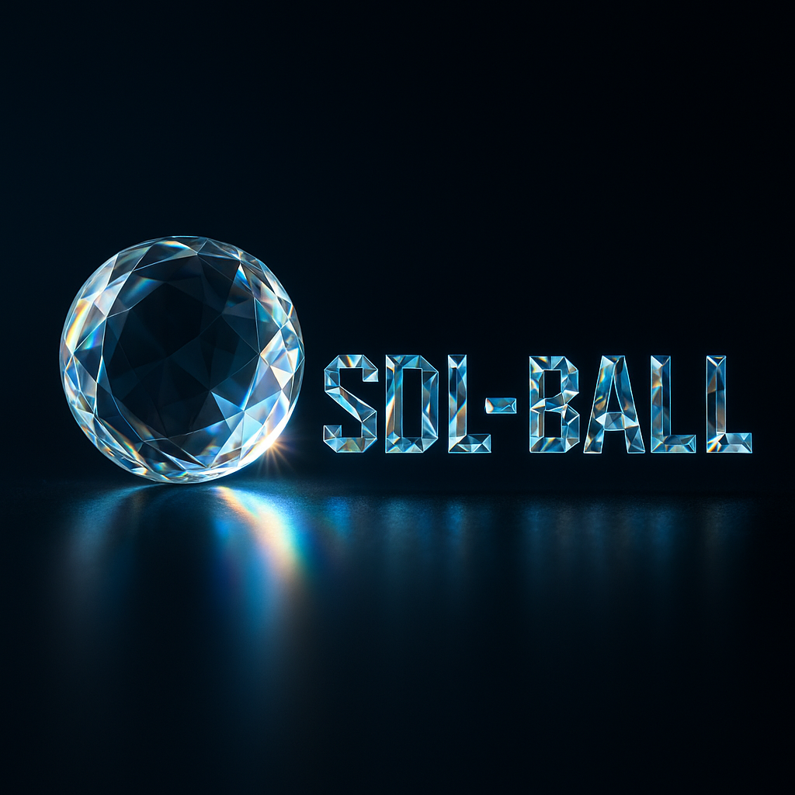

# Todo

Besides the obvious things like fixing bugs, refactoring and moving on SDL3 and shaders,
there are a lot of things to do.

## Pipeline

[Current things I am on](CURRENT.md)

## Overview

GameObjects: Balls, Paddle, Bricks, Powerups, Tracer, etc.

- [ ] Player_Tests, missing lives etc

- [ ] Powerup_Tests
- [ ] PowerupManager, rework

- [ ] Bullet, rework
- [ ] Bullet_Tests

- [ ] HUD-Manager
- HUD (Score, Clock, Lives, Level, Speedometer, Powerups consumed (bottom), Shop (top))
    - [ ] Score
    - [ ] Clock
    - [ ] Lives
    - [ ] Level
    - [ ] Powerups consumed (bottom)
    - [ ] Shop (top)
    - [ ] Speedometer
- [ ] HudManager_Tests

___

- [ ] SceneManager
- [ ] GameManager, create
- [ ] GameManager_Tests
- [ ] CodeManager_Tests

- [ ] **Game should be playable again**

- [ ] InputManager_Tests
- [ ] HighscoreManager_Tests
- [ ] SaveGame

## Misc

- [ ] check early game field sizes, should I go exactly 4:3 and then render the pillars outside?
  scissor rectangle needs to be expanded to the playfield plus the pillars
- [ ] Many comments are in German

## Gameplay

- [ ] setting titleScreenShow ? / intro-scenes, skip all. themeSwitch-scene, asked if classic, retro or current theme
- [ ] Fade in Paddle?
- [ ] Fade in Ball?
- [ ] Lift in with a hub?
- [ ] fix speedometer

## Auxiliary

- [ ] rework the powerup shop

## After classic overhaul

- [ ] use player name from config
- [ ] open website from title screen

- [ ] https://examples.libsdl.org/SDL3/demo/04-bytepusher/

- [ ] use SDL 3, not sure if I should maintain SDL2 plus Emscripten
  When the game is done with classic Theme, try emscripten to play in browser, after that, move on to SDL3 and Shaders

- [ ] Emscripten and SDL3 - far away
- [ ] use shaders, start with backgroundManager or splash screen
- [ ] using a physics engine at this point might be overkill.
- [ ] use OpenGL debug callbacks - think this is not worth for legacy gl anymore

- [ ] ScreenshotManager with UI?

- [ ] Splash screen
  
  music: [see](../../tests/themes/test/music/)
