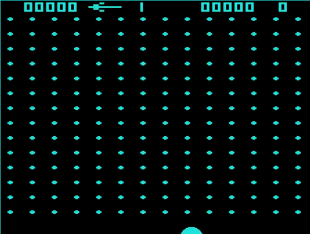

# Game History

https://en.wikipedia.org/wiki/Breakout_(video_game)

[ ] bring my own researches into this ( find first =) )

Atari 2600, 1976
https://atari.com/pages/breakout?srsltid=AfmBOorhHtA2S0oXoYLhtrpe8O4zG_ldgQn9MUzpIRjFNIrOektR3S-B

Breakout is an arcade video game developed and published by Atari, Inc.[7] and released on May 13, 1976.[2] Breakout was
released in Japanese arcades by Namco. The game was designed by Nolan Bushnell and Steve Bristow and prototyped via
discrete logic chips by Steve Wozniak with assistance from Steve Jobs.

In the game, eight rows of bricks line the top portion of the screen, and the player's goal is to destroy the bricks by
repeatedly bouncing a ball off a paddle into them. The concept was predated by Ramtek's Clean Sweep (1974), but the
game's designers were influenced by Atari's own Pong (1972).

The arcade version of Breakout uses a monochrome display underneath a translucent colored overlay.

## Clean Sweep

https://www.arcade-museum.com/Videogame/clean-sweep
The game uses TTL instead of a CPU and is among the first video games to use RAM to store the game state and ROM to
store graphics.

http://www.thealmightyguru.com/Wiki/index.php?title=Clean_Sweep

https://www.mobygames.com/game/88424/clean-sweep/

Mame Set Version :0.230Cpu :Netlist CPU DeviceCpu Clock :1000 Mhz
501075.c6 32 B f1c616a73c6c2915ea3d0252543b0806704ab2e9
501076.d7 32 B 07fb64ea8caee601e3e3bd6c69beea619dd0489d
501074.k3 32 B 471ca9d99851591ff11a87d18b88871edd7fd268
