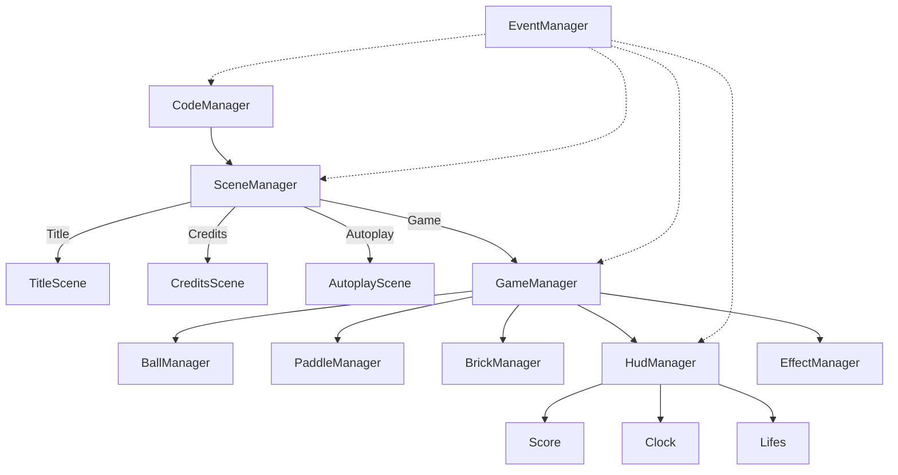

# Meta Docs

Architektur als **Kasten-Diagramm** (z\.B\. mit UML oder einfachen Blockdiagrammen) visualisieren\.

Für eine **interaktive Darstellung** eignen sich Tools wie **Mermaid** \(Markdown\-Diagramme\), **draw\.io**, **PlantUML
**, oder Web\-Frameworks \(z\.B\. D3\.js für dynamische Graphen\)\.

**Vorschlag für eine statische Visualisierung mit Mermaid:**



**Interaktiv:**  
Mit **D3\.js** oder **React Flow** kannst du die Komponenten als klickbare Knoten darstellen, Events simulieren und
Zustandsänderungen visualisieren\.  
Für schnelle Prototypen reicht oft auch ein interaktives Whiteboard \(z\.B\. Miro, Excalidraw\)\.  
In Markdown\-Dokumentation ist Mermaid am einfachsten und direkt im Editor darstellbar\.

## React Flow

https://reactflow.dev/

## D3.js

https://d3js.org/

## Matplotlib

```python
import networkx as nx
import matplotlib.pyplot as plt

G = nx.DiGraph()
G.add_edge("CodeManager", "SceneManager")
G.add_edge("SceneManager", "TitleScene")
G.add_edge("SceneManager", "CreditsScene")
# weitere Kanten …

nx.draw(G, with_labels=True, node_color="lightblue", arrows=True)
plt.show()
```

## graphviz

## pyvis

```python
from pyvis.network import Network

net = Network(directed=True)
net.add_node("CodeManager")
net.add_node("SceneManager")
net.add_edge("CodeManager", "SceneManager")
# weitere Knoten und Kanten …

net.show("architektur.html")
```

## Plotly

## Citoscape.js

https://js.cytoscape.org/

## GoJS

https://gojs.net

## notes

D3.js ist für interaktive Diagramme und Visualisierungen sehr gut geeignet, besonders wenn du individuelle,
programmatische Darstellungen deiner Codebase oder Architektur möchtest. Damit kannst du flexibel eigene Sichten und
Interaktionen gestalten, was mit statischen Tools oft nicht möglich ist.
Programme zur Visualisierung und Analyse von Codebasen (z.B. Architekturdiagramme, Abhängigkeitsgraphen,
Klassendiagramme) gehören thematisch eher zum Bereich architecture. Sie unterstützen das Verständnis, die Planung und
die Dokumentation der Systemstruktur.
Fazit:
D3.js ist eine sinnvolle Wahl für interaktive, maßgeschneiderte Diagramme.
Solche Visualisierungstools und -skripte sind Teil der Architektur-Dokumentation und gehören in den Bereich
architecture.